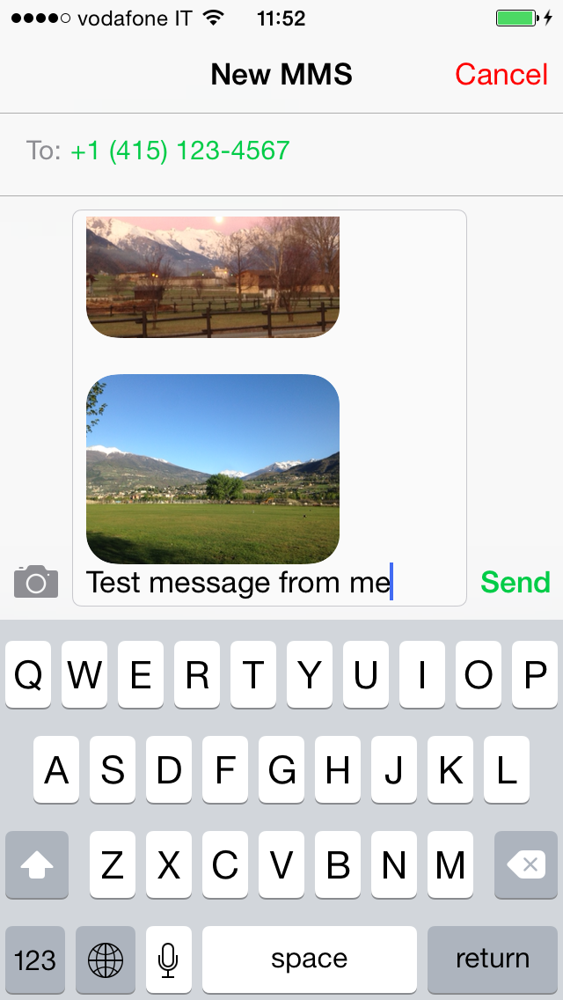

# SMSDialog Module

## Description

The SMSDialog Module extends the Appcelerator Titanium Mobile framework implementing an iPhone dialog window that enables you to send in application text messages on behalf of the app user, exposing an API very similar to the one of the Ti.UI.EmailDialog object. Both recipients and body fields can be pre-populated from your application.


# New in Version 1.1.0: attachments support



Since iOS version 7.0, the `MFMessageComposeViewController` class allows adding attachments to SMS or iMessage messages, thus enabling the ability to send MMSs.
The SMSDialog module has been extended in order to support this feature through new API methods and properties:

* `canSendAttachments()`: return true if the current device/os combination allows sending attachments
* `disableUserAttachments()`: Disables the camera/attachment button in the message composition view
* `addAttachment(attachment, alternateFileName)`: add a new attachment as a string file path, or TiBlob, optionally setting an alternate file name for it


## Building and installing the SMSDialog Module ##

### BUILD ###
First, you must have your XCode and Titanium Mobile SDKs in place, and have at least read the first few pages of the [iOS Module Development Guide](http://docs.appcelerator.com/titanium/latest/#!/guide/iOS_Module_Development_Guide).

The build process can be launched using the build.py script that you find in the module's code root directory.

As a result, the `com.omorandi-iphone-1.1.0.zip` file will be generated.

### INSTALL ###
You can either copy the module package (`com.omorandi-iphone-1.1.0.zip`) to `~/Library/Application\ Support/Titanium` and reference the module in your application (the Titanium SDK will automatically unzip the file in the right place), or manually launch the command:

     unzip -u -o com.omorandi-iphone-1.1.0.zip -d ~/Library/Application\ Support/Titanium/


## Referencing the module in your Titanium Mobile application ##

Simply add the following lines to your `tiapp.xml` file:

    <modules>
        <module version="1.1.0" platform="iphone">com.omorandi</module>
    </modules>


## Accessing the SMSDialog Module

To access this module from JavaScript, you would do the following:

	var moduleObj = require("com.omorandi");

The moduleObj variable is a reference to the Module object.

The provided API is extremely simple: once the module is instantiated, you can create an SMSDialog object and use it for opening an SMS dialog window, evenutally pre-populated with recipient numbers and a message body:

        smsDialog = module.createSMSDialog({
	    recipients: ['+14151234567'],
	    messageBody: 'Test message from me',
	    barColor: 'red'});

        smsDialog.open({animated: true});

## Reference

### `SMSDialog.addRecipient(arg)` Method

Add a recipient for the message to be sent

`arg`: a string containing the phone number of the recipient


### `SMSDialog.isSupported()` Method

Check if the device provides in-app SMS sending capabilities

return value: `true` if in app SMS sending is supported on the device at hand; false otherwise

### `SMSDialog.open(arg)` Method

Open the SMS dialog in a modal window

`arg`: an object containing animation properties
The only supported property is:

* `animated`: (bool) if true the window is opened with a slide-in animation


### SMSDialog.barColor Property

(string) color of the title bar

### SMSDialog.messageBody Property

(string) the text of the message to be sent

### SMSDialog.recipients Property

(array) array of strings containing the recipients phone numbers


## Events

The SMSDialog object supports only the `'complete'` event, which is fired when the user interacts with the dialog window, reporting the result of the operation.

The event object contains the following properties:

### `result`
An integer value representing the result of the operation. Possible values for this property are:

* `SMSDialog.SENT`
* `SMSDialog.FAILED`
* `SMSDialog.CANCELLED`

which are quite self-explanatory ;-)

### `success`
a boolean value that is true if the message has been sent out correctly, and false otherwise

### `resultMessage`
a string containing a textual description of the result


## Usage

```JavaScript
//instantiate the module
var module = require('com.omorandi');
Ti.API.info("module is => " + module);

//create the smsDialog object
var smsDialog = module.createSMSDialog();

//check if the feature is available on the device at hand
if (!smsDialog.isSupported())
{
    //falls here when executed on iOS versions < 4.0 and in the emulator
    var a = Ti.UI.createAlertDialog({title: 'warning', message: 'the required feature is not available on your device'});
    a.show();
}
else
{
    //pre-populate the dialog with the info provided in the following properties
    smsDialog.recipients = ['+14151234567'];
    smsDialog.messageBody = 'Test message from me';

    //set the color of the title-bar
    smsDialog.barColor = 'red';

	//add attachments if supported
    if (smsDialog.canSendAttachments()) {
        Ti.API.info('We can send attachments');
        //add an attachment as a file path
        smsDialog.addAttachment('images/01.jpg', 'image1.jpg');

        var file = Ti.Filesystem.getFile('images/02.jpg');
        //add an attachment as a TiBlob
        smsDialog.addAttachment(file.read(), 'image2.jpg');
    }
    else {
        Ti.API.info('We cannot send attachments');
    }

    //add an event listener for the 'complete' event, in order to be notified about the result of the operation
    smsDialog.addEventListener('complete', function(e){
        Ti.API.info("Result: " + e.resultMessage);
        var a = Ti.UI.createAlertDialog({title: 'complete', message: 'Result: ' + e.resultMessage});
        a.show();
        if (e.result == smsDialog.SENT)
        {
            //do something
        }
        else if (e.result == smsDialog.FAILED)
        {
              //do something else
        }
        else if (e.result == smsDialog.CANCELLED)
        {
              //don't bother
        }
    });

    //open the SMS dialog window with slide-up animation
    smsDialog.open({animated: true});
}

```

## Author

**Olivier Morandi**

    email: olivier.morandi@gmail.com
    twitter: olivier_morandi

## License

    Copyright (c) 2010-2014 Olivier Morandi

    Permission is hereby granted, free of charge, to any person obtaining a copy
    of this software and associated documentation files (the "Software"), to deal
    in the Software without restriction, including without limitation the rights
    to use, copy, modify, merge, publish, distribute, sublicense, and/or sell
    copies of the Software, and to permit persons to whom the Software is
    furnished to do so, subject to the following conditions:

    The above copyright notice and this permission notice shall be included in
    all copies or substantial portions of the Software.

    THE SOFTWARE IS PROVIDED "AS IS", WITHOUT WARRANTY OF ANY KIND, EXPRESS OR
    IMPLIED, INCLUDING BUT NOT LIMITED TO THE WARRANTIES OF MERCHANTABILITY,
    FITNESS FOR A PARTICULAR PURPOSE AND NONINFRINGEMENT. IN NO EVENT SHALL THE
    AUTHORS OR COPYRIGHT HOLDERS BE LIABLE FOR ANY CLAIM, DAMAGES OR OTHER
    LIABILITY, WHETHER IN AN ACTION OF CONTRACT, TORT OR OTHERWISE, ARISING FROM,
    OUT OF OR IN CONNECTION WITH THE SOFTWARE OR THE USE OR OTHER DEALINGS IN
    THE SOFTWARE.